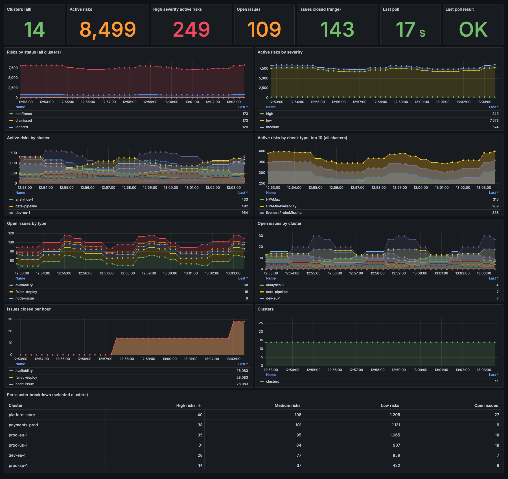
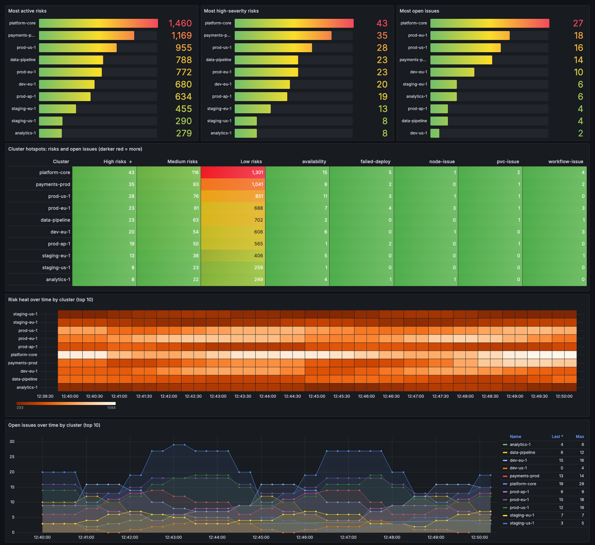

# komodor-metrics-exporter

Prometheus exporter for the [Komodor](https://komodor.com) public API. It polls on an interval and exposes counts you can scrape (Prometheus, or the OpenTelemetry Collector's `prometheus` receiver) to keep history the API itself does not retain.

## Metrics

| Metric | Labels | Notes |
|---|---|---|
| `komodor_clusters` | | Clusters connected to Komodor |
| `komodor_reliability_risks` | `status`, `severity` | All statuses: open, confirmed, resolved, dismissed, ignored, manually_resolved |
| `komodor_reliability_risks_active` | `cluster`, `severity` | Open + confirmed risks |
| `komodor_reliability_risks_by_check` | `check_type` | Open + confirmed risks per check type |
| `komodor_issues_open` | `cluster`, `type` | See limits below |
| `komodor_issues_closed_total` | `cluster`, `type` | Counter of issues seen closing since start |
| `komodor_exporter_api_request_duration_seconds` | `endpoint`, `code` | Histogram per API attempt, buckets 0.1s to 300s |
| `komodor_exporter_collection_step_duration_seconds` | `step` | Histogram per collection step (`clusters`, `risks`, `risks_active`, `risks_by_check`, `issues`) |
| `komodor_exporter_last_poll_timestamp_seconds`, `komodor_exporter_last_poll_success`, `komodor_exporter_last_success_timestamp_seconds`, `komodor_exporter_errors_total` | | Exporter health: when the last poll finished, whether it fully succeeded, when one last fully succeeded (0 until the first full success), and a failure counter |

## Configuration

Every setting is a flag, and also an environment variable with the `KOMODOR_` prefix (`--poll-interval` is `KOMODOR_POLL_INTERVAL`). Precedence: flag, then env, then `--config` file, then default. Run with `--help` for the list.

| Flag | Default | |
|---|---|---|
| `--api-key` | required | Sent as `X-API-KEY`. Prefer `KOMODOR_API_KEY`; flags show up in process listings |
| `--api-url` | `https://api.komodor.com` | |
| `--disable` | none | Metric groups to switch off, comma-separated (`KOMODOR_DISABLE`) |
| `--skip-issues` | none | What not to query for issues, comma-separated (`KOMODOR_SKIP_ISSUES`) or a list in the config file: an issue type (every cluster), or `cluster/type` where either side may be `*` |
| `--issue-types` | all | Only query these issue types: `availability`, `failed-deploy`, `node-issue`, `pvc-issue`, `workflow-issue` |
| `--max-retries` | `2` | Retries per request on 5xx (not 504), 429 and network errors, with exponential, jittered backoff (1s, 2s, 4s, ... up to 15s) |
| `--issues-window` | `1h` | How far back to look for closed issues (at least 2x the poll interval, max 48h). Open issues always use 48h |
| `--concurrency` | `8` | Maximum concurrent cluster-scoped and issues requests |
| `--slow-concurrency` | `2` | Maximum concurrent account-wide risk queries (a separate pool, see below) |
| `--poll-interval` | `5m` | Minimum `30s`. A poll is cancelled if it runs longer than this |
| `--request-timeout` | `2m` | Timeout per API attempt; raise it for slow endpoints |
| `--listen-addr` | `:9090` | Serves `/metrics` and `/healthz` |
| `--log-level` | `info` | `debug`, `info`, `warn`, `error` |
| `--log-format` | `json` | `json` or `text` |
| `--config` | none | Optional yaml/json/toml file using the same keys, e.g. `poll-interval: 10m` |

## Concurrency and slow queries

In-flight requests are limited per attempt, not per call, so a request waiting in retry backoff does not hold a slot. Account-wide risk queries (no cluster filter: `risks` and `risks_by_check`) can take a minute or hit a gateway timeout on large accounts, so they use their own small pool (`--slow-concurrency`) and cannot starve the fast per-cluster calls. Up to `--concurrency` + `--slow-concurrency` requests can therefore be in flight at once. 5xx responses and network errors are retried with backoff, but a 504 is not, since the retry would just wait out the same timeout. If an account-wide risk query times out (a 504 or a client timeout, which happens on accounts with a very large number of risks) the exporter sums the same count over each cluster instead, so the metric is still complete. A query that still fails keeps its previous value and the rest of its group is published.

## Choosing metrics

All metric groups are on by default. Each is a toggle named after its metric family:

| Group | Metrics |
|---|---|
| `clusters` | `komodor_clusters` |
| `risks` | `komodor_reliability_risks` |
| `risks_active` | `komodor_reliability_risks_active` |
| `risks_by_check` | `komodor_reliability_risks_by_check` |
| `issues` | `komodor_issues_open`, `komodor_issues_closed_total` |

Switch groups off in the config file (see [`config.example.yaml`](config.example.yaml)), or with `--disable issues,risks_by_check` / `KOMODOR_DISABLE=issues,risks_by_check`. A disabled group makes no API calls and its series are not exposed, so disabling `issues` removes the most expensive calls. The cluster list is still fetched if `risks_active` or `issues` is on. Exporter health metrics are always exposed, and an unknown group name is rejected at startup. Switch every group off and the exporter makes no API calls.

## Skipping broken issue queries

The issues API can return a persistent 500 for a single cluster and type (for example `my-cluster/node-issue`), which would otherwise fail every poll and raise `komodor_exporter_errors_total`. Skip the pair and the rest is unaffected:

```yaml
skip-issues:
  - node-issue           # this type on every cluster (same as "*/node-issue")
  - my-cluster/pvc-issue # one type on one cluster
  - legacy/*             # every type on one cluster
```

The same list works as `--skip-issues my-cluster/node-issue,legacy/*` or `KOMODOR_SKIP_ISSUES`. Entries are validated at startup, and one naming a cluster that does not exist is logged as a warning.

## Logging

Structured logs (JSON by default) go to stderr. At `--log-level debug` every API attempt is logged with method, URL, status and duration, along with retry decisions and per-cluster issue counts. Request headers are never logged, so the API key stays out.

```sh
docker run -e KOMODOR_API_KEY=... -p 9090:9090 ghcr.io/davidcollom/komodor-metrics-exporter
```

## Deploy with Helm

Released versions are published as an OCI chart (the chart version matches the release tag, without the `v`):

```sh
helm install komodor-metrics-exporter oci://ghcr.io/davidcollom/charts/komodor-metrics-exporter --version 0.1.6 --set apiKey=...
```

The chart source is in [`deploy/helm/komodor-metrics-exporter`](deploy/helm/komodor-metrics-exporter). It takes the API key as a Secret and the exporter configuration as a ConfigMap, mounted and passed with `--config`:

```sh
helm install komodor-metrics-exporter deploy/helm/komodor-metrics-exporter \
  --set apiKey=... \
  --set 'config.skip-issues={my-cluster/node-issue}' \
  --set config.metrics.risks_by_check=false
```

- **API key:** set `apiKey` and the chart creates the Secret, or point `existingSecret` (and `existingSecretKey`, default `api-key`) at one you manage. The key never goes into the ConfigMap. With `existingSecret` set the chart creates no Secret and ignores `apiKey`, so it works with anything that produces a Kubernetes Secret (External Secrets Operator, Sealed Secrets, SOPS, Vault injector, a plain `kubectl create secret`):

  ```sh
  kubectl create secret generic komodor-api --from-literal=api-key=...
  helm install komodor-metrics-exporter oci://ghcr.io/davidcollom/charts/komodor-metrics-exporter --set existingSecret=komodor-api
  ```
- **Config:** everything under `config:` in [`values.yaml`](deploy/helm/komodor-metrics-exporter/values.yaml) is the exporter's config file, with the exporter's own defaults and every metric group on. Changing it rolls the pod. Use `env` to override a value with a `KOMODOR_*` variable.
- **Chart docs:** the chart's own [README](deploy/helm/komodor-metrics-exporter/README.md), with a table of every value and an External Secrets example, ships in the package (`helm show readme`).
- **Scraping:** the Service exposes `/metrics` on 9090. Set `serviceMonitor.enabled=true` if you run the Prometheus Operator.
- It runs a single replica, non-root, with a read-only root filesystem. The chart has [unit tests](deploy/helm/komodor-metrics-exporter/tests) that run in CI with [helm-unittest](https://github.com/helm-unittest/helm-unittest).

## Demo stack

`demo/` has a Docker Compose stack that builds the exporter from source and runs it with Prometheus and Grafana, with the dashboard already provisioned:

```sh
cd demo && KOMODOR_API_KEY=... docker compose up --build
```

Grafana is at http://localhost:3000 (login `admin` / `demo`), Prometheus at http://localhost:9091 and the exporter's `/metrics` at http://localhost:9092/metrics. It polls every 5 minutes by default (`KOMODOR_POLL_INTERVAL` changes it, and an account with many clusters needs the longer interval: a poll that does not finish within the interval is cut off and counts as failed), so give the first poll a moment. Set `KOMODOR_SKIP_ISSUES=cluster/type` (see below) if one cluster's issues query fails and keeps the poll from counting as successful. Prometheus data is kept in a named volume, so `docker compose down` keeps it and `docker compose down -v` deletes it. To pick up exporter code changes without touching Prometheus or Grafana, run `docker compose up -d --build --no-deps exporter`.

## Grafana dashboards

Import the JSON files in [`dashboards/`](dashboards) into Grafana and pick your Prometheus data source. The demo stack loads both automatically.

- **Komodor Platform Metrics** ([`komodor-platform.json`](dashboards/komodor-platform.json)): an overview. A multi-select **Cluster** variable (default All) filters the per-cluster panels: active risks, risks by severity, open and closed issues, and a per-cluster breakdown table. Panels labelled "all clusters" (risks by status and by check type) are not per-cluster metrics, so the variable does not filter them. Exporter freshness and the last poll result are in the top row. Gaps in the lines are connected.
- **Komodor Hotspots** ([`komodor-hotspots.json`](dashboards/komodor-hotspots.json)): which clusters need attention. Top-N bars (set **Top N**) for the most active risks, high-severity risks and open issues, a heat table with one row per cluster and a column per severity and issue type (darker red means more, sorted by high-severity risks), and a heatmap and chart of how risk and open issues change over time per cluster.

**Platform Metrics**



**Hotspots**



_Both screenshots show made-up data from a mock API; the cluster names are invented._

## Safety: read-only

The exporter only ever makes three read requests: `GET /api/v2/clusters`, `GET /api/v2/health/risks` and `POST /api/v2/clusters/issues/search` (a search that takes a body). The client refuses any other method and path before it leaves the process, and a unit test pins that list, so even an API key that is allowed to modify your Komodor account cannot be used to change anything through this exporter. Give it the least-privileged key you can regardless, ideally a read-only one.

The `live` workflow runs read-only tests against a real account. It is manual (`workflow_dispatch`) only, uses the repository secret `KOMODOR_API_KEY`, and prints only numbers and status codes, never cluster names, because the logs of a public repository are public.

## Limits

- Closed issues are only seen within `--issues-window` (default 1h), so one that closes after being open for longer than that may be missed if the API filters on start time rather than end time; raise the window if you see gaps. The issues API only looks back 2 days per query and returns no issue ID. Issues open for more than 2 days are not counted in `komodor_issues_open`, and closed issues are deduplicated on cluster, type, start time and summary, so `komodor_issues_closed_total` is approximate. Closed issues present at startup are not counted.
- Risk metrics come from `totalResults` on one-row pages, so no risks are paged. Issues have no total, so they are paged per cluster and type (two calls per pair: open issues over the last 48 h, closed issues over `--issues-window`), and API calls per poll grow with cluster count. Steps run concurrently, capped by `--concurrency`.
- Failed API calls are retried up to 4 times with backoff (429 and 5xx), so a briefly rate-limited poll usually still completes.
- History starts when the exporter does; nothing is backfilled.

## Release

Tag `vX.Y.Z`; GitHub Actions runs GoReleaser to publish binaries and the `ghcr.io` image.

## Development

```sh
go run . --help          # run from the repo root
go test -race ./...      # unit tests, no network needed
```

Layout:

| Path | Purpose |
|---|---|
| `main.go` | Entry point; only calls `cmd.Execute` (the version is injected here by GoReleaser) |
| `cmd/` | Cobra command, flags, Viper config and logging setup, and the HTTP server |
| `internal/komodor/` | Komodor API client: retries, backoff, in-flight limits, request metrics |
| `internal/collector/` | Polling and the Prometheus metrics, metric-group toggles and the issue filter |
| `deploy/helm/` | Helm chart and its unit tests |
| `dashboards/`, `demo/` | Grafana dashboard and the Docker Compose demo |
